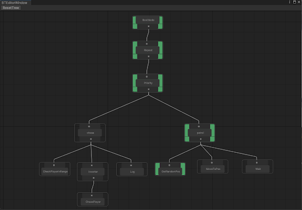
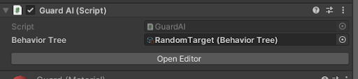
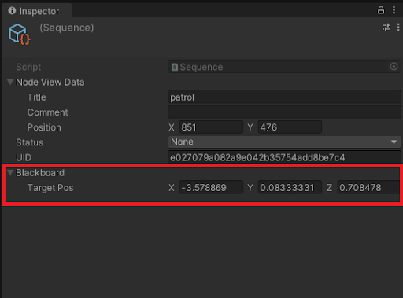
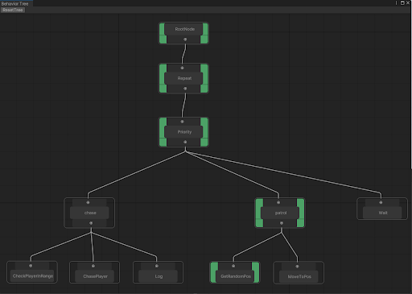
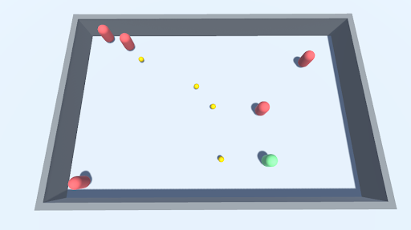
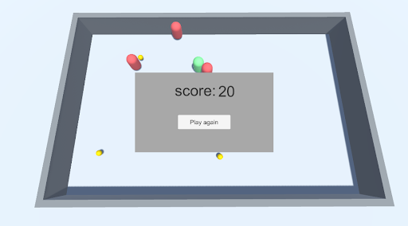

# Project Overview

This project is a Unity-based application designed to create, view, and edit behavior trees for AI behavior in games.

# Features

- Creating a behavior tree.
- Viewing and editing nodes in real-time.
- Running and visualizing AI behavior during gameplay.

# Install

## Using package

Download package in release notes, then drop it in Unity Editor.

# Usage

## Creating a New Behavior Tree

- Go to `Assets` > `Create` > `BehaviorTree` > `BehaviorTree`.
- Name your new behavior tree asset.
## Editing Nodes

- Select the behavior tree asset.
- Use the Behavior Tree Editor to add and connect nodes.



## Viewing Runtime Behavior
- Enter Play mode in the Unity Editor.
- Select the object that has the BehaviorTree Component.
- Click "Open Editor" in the Component.



## CustomNode

### Creating a Custom Node 
- Create a New Script
In the Unity Editor, navigate to the Assets folder.
- Define the Custom Node Class
Open the script and define your custom action node class. Make sure it inherits from ActionNode.
``` C#
using UnityEngine;
using UnityBehaviorTree.Core;

namespace UnityBehaviorTree.CustomNodes
{
    [System.Serializable]
    public class CustomActionNode : ActionNode
    {
        // Add any custom fields or properties here

        protected override void OnActionStart()
        {
            // Initialization code here
        }

        protected override void OnActionStop()
        {
            // Cleanup code here
        }

        protected override EStatus OnActionUpdate()
        {
            // Update logic here
            return EStatus.Success;
        }
    }
}
```

## Blackboard TODO



# Sample AI

## Gameplay

- Objective: Collect gold while avoiding AI-controlled guards.
- Objects: Guard, Player, Gold.

## Behavior Tree for Guard AI
- Guard AI.



## Game Interface




